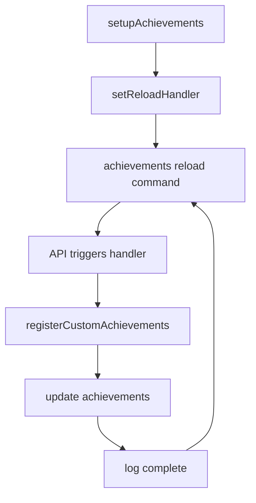

import Tabs from '@theme/Tabs';
import TabItem from '@theme/TabItem';

# Installatie

<Tabs groupId='build-tool' queryString>
  <TabItem value="gradle" label="Gradle" default>
    Dus je wilt achievements gebruiken in jouw gradle project? In welke bestand dan?
    <Tabs groupId='language' queryString>
      <TabItem value="java" label="build.gradle" default>
        Voor een gradle project met een build.gradle bestand, gebruik de volgende configuratie:
        **Repository:**
        ```groovy
        repositories {
            maven { url 'https://jitpack.io' }
        }
        ```
        **Dependency:**
        ```groovy
        dependencies {
            compileOnly 'com.github.Marten-Mrfc:Achievements:main-SNAPSHOT'
        }
        ```
      </TabItem>
      <TabItem value="kotlin" label="build.gradle.kts">
        Voor een gradle project met een build.gradle.kts bestand, gebruik de volgende configuratie:
        **Repository:**
        ```kotlin
        repositories {
            maven { url = uri("https://jitpack.io") }
        }
        ```
        **Dependency:**
        ```kotlin
        dependencies {
            compileOnly("com.github.Marten-Mrfc:Achievements:main-SNAPSHOT")
        }
        ```
      </TabItem>
    </Tabs>
  </TabItem>
  <TabItem value="maven" label="Maven">
    Dus je wilt achievements gebruiken in jouw maven project? Gebruik deze maven configuratie:

    **Repository:**
    ```xml
    <repository>
        <id>jitpack.io</id>
        <url>https://jitpack.io</url>
    </repository>
    ```

    **Dependency:**
    ```xml
    <dependency>
        <groupId>com.github.Marten-Mrfc</groupId>
        <artifactId>Achievements</artifactId>
        <version>main-SNAPSHOT</version>
        <scope>provided</scope>
    </dependency>
    ```
  </TabItem>
</Tabs>


<Tabs groupId='language' queryString>
  <TabItem value="java" label="Java" default>
    Nu heb je succesvol de dependencies toegevoegd, maar hoe gebruik je het nu in jouw Java project?
    
    Eerst maak je een register functie aan.
    ```java
    private void registerCustomAchievements() {
        // Deze vullen we later in (:
    }
    ```
    Vervolgens kan je of in je onEnable of in een extra functie de achievements link opstarten. Ik adviseer om een extra functie te maken zoals in het volgende voorbeeld:
    ```java
    private void setupAchievements() {
        try {
            AchievementAPI.setReloadHandler(this.getName(), this::registerCustomAchievements);
            registerCustomAchievements();
            getLogger().info("Achievements setup complete.");
        } catch (Exception e) {
            getLogger().severe("Error setting up achievements: " + e.getMessage());
        }
    }
    ```
  Nu als laatste roep je de setupAchievements functie aan in je onEnable functie.
    ```java
    @Override
    public void onEnable() {
        getLogger().info("Setting up achievements with AchievementAPI...");
        setupAchievements();
    }
    ```
  </TabItem>
  <TabItem value="kotlin" label="Kotlin">
    Nu heb je succesvol de dependencies toegevoegd, maar hoe gebruik je het nu in jouw Kotlin project?
    
    Eerst maak je een register functie aan.
    ```kotlin
    private fun registerCustomAchievements() {
        // Deze vullen we later in (:
    }
    ```
    Vervolgens kan je of in je onEnable of in een extra functie de achievements link opstarten. Ik adviseer om een extra functie te maken zoals in het volgende voorbeeld:
    ```kotlin
    private fun setupAchievements() {
        try {
            AchievementAPI.setReloadHandler(name) { registerCustomAchievements() }
            registerCustomAchievements()
            logger.info("Achievements setup complete.")
        } catch (e: Exception) {
            logger.severe("Error setting up achievements: ${e.message}")
        }
    }
    ```
  Nu als laatste roep je de setupAchievements functie aan in je onEnable functie.
    ```kotlin
    override fun onEnable() {
        logger.info("Setting up achievements with AchievementAPI...")
        setupAchievements()
    }
    ```
  </TabItem>
</Tabs>

## Visualisatie van de loop
Hier is een simpele visualisatie van de loop die je moet volgen om achievements te registreren en te gebruiken in jouw plugin:

